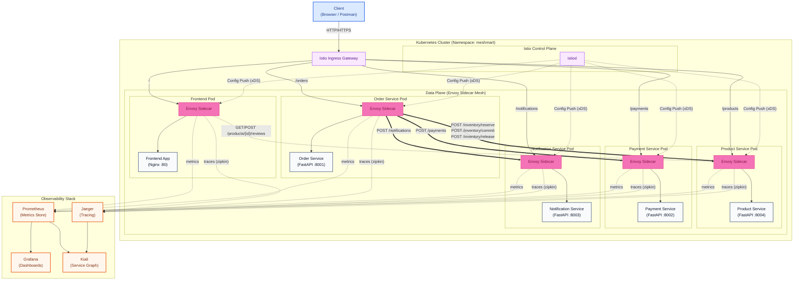
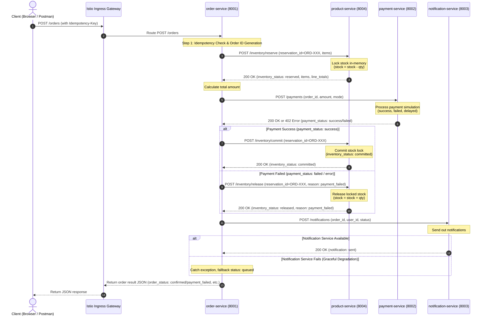
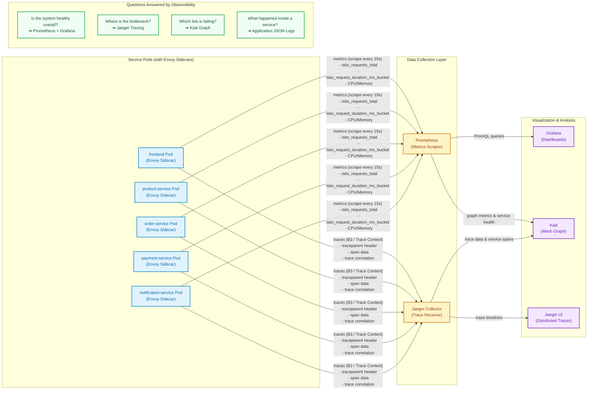
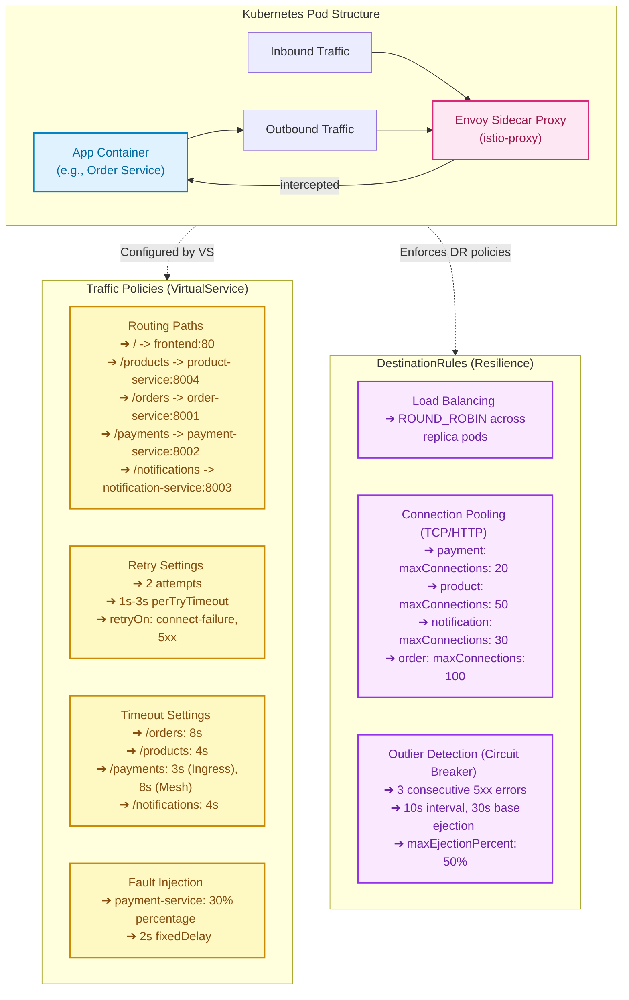

# Updated Architecture Diagrams & Flow Analysis

This document contains the updated architecture diagrams for the **MeshMart Service Mesh Observability Platform**. The diagrams have been updated to reflect the new features in the codebase:
1. **Namespace Update**: Transitioned from `shopping-demo` to `meshmart`.
2. **Saga Transaction Pattern (Inventory Reservation)**: Integrated `/inventory/reserve`, `/inventory/commit`, and `/inventory/release` (compensation) flows between `order-service` and `product-service` to manage product stock safely during payment success/failure.
3. **Idempotency-Key Support**: Added header-based idempotency checks on checkout (`POST /orders`).
4. **Product Rating & Reviews API**: Added `/products/{id}/reviews` (GET/POST) endpoints to `product-service`.
5. **Traffic & Resilience Configurations**: Updated timeouts, retries, fault injection parameters, and DestinationRule circuit breaker settings (outlier detection and connection pooling) to match the actual configs in `istio/`.

---

## 1. System Architecture Diagram
*This diagram shows the layout of components in the `meshmart` Kubernetes namespace, their sidecar proxies, control plane, and how the observability stack collects telemetry.*

### Key Highlights
- **Ingress Gateway Routing**: The Gateway routes public API endpoints based on the path prefixes defined in `istio/virtual-service.yaml` (e.g. `/orders` to `order-service`, `/products` to `product-service`).
- **Saga Network Calls**: The thick green arrows highlight the business transaction flow orchestrated by `order-service` using the Saga pattern.
- **Sidecar Instrumentation**: Each container runs alongside an `istio-proxy` (Envoy) sidecar which handles all inbound/outbound communication, trace context propagation (Zipkin/B3 headers), and metrics emission.

---

## 2. Business Request Flow (Sequence Diagram) - Saga Orchestration
*This sequence diagram captures what happens when a client calls `POST /orders`. It highlights how order placement, inventory reservation/commit/release, and notification sending are orchestrated.*

### Detailed Sequence Breakdown
1. **Idempotency Key Verification**: The `order-service` checks if the `Idempotency-Key` header has been processed before. If it has succeeded, it returns the cached JSON order confirmation. If it is currently processing, it returns a `409 Conflict`.
2. **Phase 1 (Reserve)**: The `order-service` acts as the Saga orchestrator. It immediately calls `product-service` on `/inventory/reserve` to check availability and lock product stock in-memory.
3. **Phase 2 (Payment)**: If stock is reserved successfully, it initiates the payment simulation.
4. **Phase 3 (Commit / Compensate)**:
   - **Commit**: If payment succeeds, it commands `product-service` to commit the reservation (`/inventory/commit`). The stock reduction becomes permanent.
   - **Compensate (Release)**: If payment fails or returns an error, it commands `product-service` to release the reservation (`/inventory/release`). The stock is credited back to the product catalog, preserving inventory consistency.
5. **Phase 4 (Notification)**: A notification is dispatched. If the `notification-service` is down, the orchestrator catches the error, registers the notification status as `queued`, and successfully responds to the user (graceful degradation).

---

## 3. Observability & Telemetry Data Flow
*This diagram illustrates how telemetry data (metrics and traces) flows from Envoy sidecars to data repositories and how Kiali, Grafana, and Jaeger consume it.*

### Telemetry Pipeline Details
- **Metrics Scraping**: Prometheus pulls Envoy-exposed endpoints every 15 seconds, tracking metrics such as HTTP request counts (`istio_requests_total`), request latency histograms, and Kubernetes system stats (CPU/Memory).
- **Trace Propagation**: When an HTTP request enters the gateway, a unique trace identifier is assigned. The Envoy sidecars pass headers like `x-request-id` and W3C `traceparent` headers downstream. Jaeger captures the resulting span telemetry.
- **Kiali Integration**: Kiali queries both Prometheus (for traffic volume and health status) and Jaeger (for distributed trace overlays) to draw a real-time topology map of service communications.

---

## 4. Istio Traffic Management & Fault Tolerance
*This diagram explains the mechanics of sidecar proxy traffic interception and summarizes VirtualService traffic policies and DestinationRule resilience rules.*

### Explanation of Resilience Settings
- **Retries & Timeouts**: If a backend service fails temporarily (e.g. standard socket errors or 503 Service Unavailable), the Envoy sidecar retries up to 2 times. If a downstream call (like calling the payment processor) exceeds the configured timeout (e.g. 8s for orders, 3s for payments), the sidecar terminates the connection to prevent cascading latency.
- **Fault Injection**: You can apply `istio/payment-fault-injection.yaml` to test how the orchestrator handles slow dependencies. It injects a `2s` fixed delay on 30% of calls to the payment service, simulating high latency in a controlled environment.
- **Connection Pools**: Limits the maximum active connections to prevent overloading database/service ports (e.g. capping `payment-service` to 20 TCP connections).
- **Outlier Detection (Circuit Breaker)**: Envoy tracks 5xx errors. If a specific replica pod of `product-service`, `payment-service`, or `notification-service` produces 3 consecutive 5xx errors within 10 seconds, it is marked as unhealthy and ejected from the load-balancer pool for 30 seconds.
