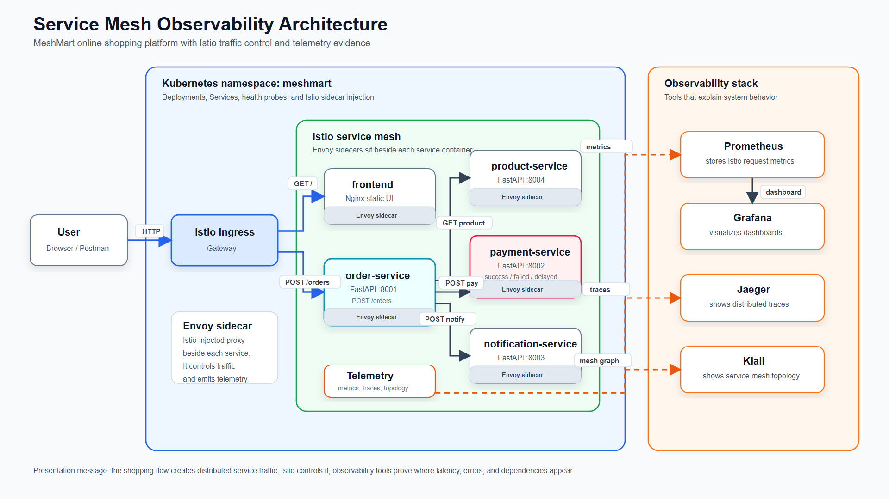
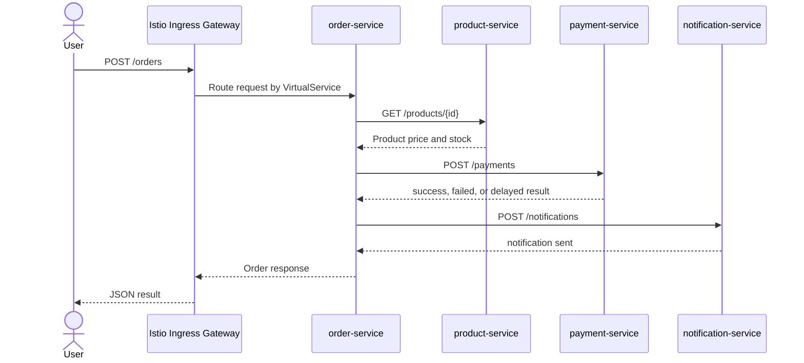

# Presentation Architecture And Speaker Script

This file is tailored to the current repository implementation. The main runtime path uses Istio Ingress Gateway as the public entry point. The optional `gateway/` FastAPI service exists in the repository, but it is not required for the main Kubernetes/Istio runtime path.

## 1. One-Sentence Project Message

This project shows how an online shopping microservices system can be controlled and observed using Istio service mesh, Kubernetes, Prometheus/Grafana metrics, Jaeger tracing, and Kiali mesh visualization.

Do not present this as only an online shopping CRUD app. The shopping flow is the business scenario; the real topic is service-to-service traffic control and observability in a distributed system.

## 2. Clean Architecture Diagram

Use the exported diagram files for the architecture slide:

- `docs/architecture-diagram.png` for PowerPoint or Google Slides.
- `docs/architecture-diagram.svg` if you want a scalable vector version.
- `docs/architecture-diagram.mmd` if you need Mermaid source.



## 3. Request Flow Diagram

Use this when explaining what happens after a user clicks Buy.



## 4. How To Explain The Architecture

### Short Version

"Our system is an online shopping microservices platform. The user enters through Istio Ingress Gateway. The frontend displays products and sends order requests. The order-service is the orchestration service: it checks product information, calls payment-service, and then calls notification-service. Around these services, Istio injects Envoy sidecars. These sidecars allow us to control traffic with routing, retry, timeout, and fault-injection rules, while also generating telemetry for Prometheus, Grafana, Jaeger, and Kiali."

### Step-by-Step Version

1. The user opens the frontend through the Istio Ingress Gateway.
2. The frontend loads products from `product-service`.
3. When the user creates an order, the request goes to `order-service`.
4. `order-service` calls `product-service` to get price and stock.
5. `order-service` calls `payment-service` to simulate normal payment, failed payment, or delayed payment.
6. `order-service` calls `notification-service` to send the order result.
7. Istio sidecars observe and control the service-to-service traffic.
8. Prometheus and Grafana show metrics, Jaeger shows traces, and Kiali shows the mesh graph.

## 5. Slide-by-Slide Speaker Script

### Slide 1 - Title

"Good morning. Our project is Service Mesh and Observability for Microservices. We built an online shopping microservices system, then deployed it with Kubernetes and Istio to show traffic control, failure handling, and observability."

### Slide 2 - Problem Statement

"Microservices are flexible because each business function can be developed and deployed separately. However, they also create a distributed-system problem. One user request may cross many services, so when the request becomes slow or fails, it is difficult to know which service caused the problem. Our project focuses on making that hidden behavior visible and controllable."

### Slide 3 - Project Objectives

"Our objectives are: first, build a real microservices flow; second, deploy it with Docker and Kubernetes; third, use Istio service mesh for routing, retry, timeout, and failure testing; fourth, use observability tools to prove request flow, latency, errors, and service health; and finally, show fault tolerance and scalability."

### Slide 4 - Use Case And Services

"The business use case is a small online shopping system. The frontend shows products. The product-service owns product catalog data. The order-service creates orders and coordinates the internal workflow. The payment-service simulates payment success, failure, and delay. The notification-service sends the final notification. This split gives us a realistic service-to-service request path."

### Slide 5 - Architecture

"This is the main architecture. External traffic enters through the Istio Ingress Gateway. The gateway routes requests by path: `/` goes to the frontend, `/products` goes to product-service, and `/orders` goes to order-service. Inside the mesh, order-service calls product-service, payment-service, and notification-service. Each workload has an Envoy sidecar, so Istio can observe and control traffic without putting all traffic-management logic inside the business code."

### Slide 6 - Request Flow

"When a user creates an order, the order request first reaches the Istio Gateway. Then it is routed to order-service. Order-service gets product information, calculates the amount, calls payment-service, and sends a notification. The final response includes order status, payment status, and notification status. This is important because one simple user action becomes multiple internal network calls."

### Slide 7 - Service Mesh Design

"Istio is the service mesh layer. In our project, it provides Gateway and VirtualService routing for external traffic. It also provides timeout and retry policies, especially around payment-service, because payment is the best place to show delay and failure. DestinationRule adds traffic policy such as connection pool and outlier detection. This keeps the business code focused on business logic while the mesh manages communication behavior."

### Slide 8 - Observability Design

"Observability answers three different questions. Metrics answer: is the system healthy overall? Traces answer: where did one request spend time? The service graph answers: which services are communicating and which edge is unhealthy? In our system, Prometheus collects metrics, Grafana visualizes them, Jaeger shows distributed traces, and Kiali shows the Istio mesh topology."

### Slide 9 - Normal Checkout

"First, we send a normal order request. The expected result is `order_status` equals `confirmed`, payment status equals `success`, and notification equals `sent`. In Grafana, latency should be low and error rate should be near zero. In Jaeger, we should see one trace passing through order-service, product-service, payment-service, and notification-service. In Kiali, we should see healthy traffic between services."

### Slide 10 - Failure And Delay Scenario

"Next, we intentionally make payment slow or failed. The user only sees that an order is slow or payment failed, but observability tells us why. Grafana shows a latency spike or an error increase. Jaeger shows the payment-service span taking the longest time. Kiali shows the affected service link. This proves that observability helps us locate the failure, not only notice that something is wrong."

### Slide 11 - Retry, Timeout, And Fault Tolerance

"Then we explain the mesh policy. Retry helps recover from temporary failures. Timeout prevents a slow dependency from blocking forever. These policies do not make the system impossible to fail, but they make failures controlled and easier to understand. That is the meaning of fault tolerance in this system."

### Slide 12 - Scalability

"For scalability, we can increase replicas of backend services and generate load with k6. Kubernetes runs multiple pods, and Istio can balance traffic across them. We compare before and after using metrics such as request count, error rate, average latency, and p95 latency. Kiali can also show traffic distribution in the mesh."

### Slide 13 - Limitations

"This project is a prototype. The current product and order data are in memory, so a production version should add a real database. Idempotency should be stored in Redis or PostgreSQL for multi-replica durability. We can also improve the system with authentication, authorization policies, mTLS details, alert rules, CI/CD, and more realistic load testing."

### Slide 14 - Conclusion

"In conclusion, our project shows a complete distributed-system implementation. The shopping application gives us a real microservices request path. Istio controls traffic and failure behavior. Observability tools provide evidence about latency, errors, traces, and service health. Therefore, the project shows not only how microservices work, but also how to operate and debug them."

## 6. Presentation Flow And Commands

Use only the commands your team has already tested before the presentation.

### Start Istio ingress access

```powershell
kubectl port-forward -n istio-system svc/istio-ingressgateway 18080:80
```

Open:

```text
http://127.0.0.1:18080
```

If port `18080` is already used by Docker Compose frontend, use:

```powershell
kubectl port-forward --address 0.0.0.0 -n istio-system svc/istio-ingressgateway 18081:80
```

### Normal order request

```powershell
$body = @{
  user_id = "customer-001"
  product_id = "PROD-001"
  quantity = 1
  payment_mode = "success"
} | ConvertTo-Json -Compress

Invoke-RestMethod `
  -Method Post `
  -Uri http://127.0.0.1:18080/orders `
  -ContentType "application/json" `
  -Body $body
```

What to say:

"This is the baseline. The order is confirmed, payment succeeds, and notification is sent. Now we have normal traffic for Grafana, Jaeger, and Kiali."

### Payment failure request

```powershell
$body = @{
  user_id = "customer-001"
  product_id = "PROD-001"
  quantity = 1
  payment_mode = "failed"
} | ConvertTo-Json -Compress

Invoke-RestMethod `
  -Method Post `
  -Uri http://127.0.0.1:18080/orders `
  -ContentType "application/json" `
  -Body $body
```

What to say:

"Payment failure is controlled. The order-service does not pretend the payment succeeded. It returns `payment_failed`, and observability shows where the failure came from."

### Slow payment timeout request

```powershell
curl.exe -i "http://127.0.0.1:18080/payment?mode=slow"
```

What to say:

"This request shows timeout behavior. Instead of waiting forever for a slow dependency, the mesh policy can fail fast and protect the system from uncontrolled waiting."

### Idempotency retry

```powershell
$key = "order-idempotency-001"
$body = @{
  user_id = "customer-001"
  product_id = "PROD-001"
  quantity = 1
  payment_mode = "success"
} | ConvertTo-Json -Compress

Invoke-RestMethod `
  -Method Post `
  -Uri http://127.0.0.1:18080/orders `
  -ContentType "application/json" `
  -Headers @{ "Idempotency-Key" = $key } `
  -Body $body

Invoke-RestMethod `
  -Method Post `
  -Uri http://127.0.0.1:18080/orders `
  -ContentType "application/json" `
  -Headers @{ "Idempotency-Key" = $key } `
  -Body $body
```

What to say:

"Both responses should return the same order id. This prevents duplicate logical orders when a client retries after a timeout or network issue."

### Open observability dashboards

```powershell
kubectl port-forward -n istio-system svc/prometheus 19090:9090
kubectl port-forward -n istio-system svc/grafana 13000:3000
kubectl port-forward -n istio-system svc/tracing 16686:80
kubectl port-forward -n istio-system svc/kiali 20001:20001
```

Dashboard URLs:

- Prometheus: `http://127.0.0.1:19090`
- Grafana: `http://127.0.0.1:13000`
- Jaeger: `http://127.0.0.1:16686/jaeger/`
- Kiali: `http://127.0.0.1:20001/kiali/`

## 7. What To Show In Each Tool

### Grafana

Question:

"Is the system healthy overall?"

Show:

- Request rate
- Error rate
- Average latency
- p95 latency

Say:

"Grafana gives us the high-level health view. It shows whether the system is fast, slow, healthy, or producing errors."

### Jaeger

Question:

"Where did this single request spend time?"

Show:

- One order trace
- Spans for order-service, product-service, payment-service, notification-service
- Payment span during delayed request

Say:

"Jaeger is useful because it follows one request across service boundaries. When payment is slow, the longest span appears in payment-service, so we can identify the bottleneck."

### Kiali

Question:

"Which services are connected, and which link looks unhealthy?"

Show:

- `istio-ingressgateway -> frontend`
- `istio-ingressgateway -> order-service`
- `order-service -> product-service`
- `order-service -> payment-service`
- `order-service -> notification-service`

Say:

"Kiali gives the mesh topology. It helps us explain the system visually and shows traffic health between services."

### Prometheus

Question:

"What raw metric data proves the dashboard?"

Useful queries:

```text
istio_requests_total
```

```text
histogram_quantile(0.95, sum(rate(istio_request_duration_milliseconds_bucket[1m])) by (le, destination_workload))
```

Say:

"Prometheus stores the raw metrics. Grafana visualizes these metrics, but Prometheus is the source of the numeric evidence."

## 8. Key Technical Points To Mention

- `order-service` is the orchestration service for the order workflow.
- `payment-service` is the best failure target because payment is critical and easy to explain.
- `Idempotency-Key` prevents duplicate logical orders during retries.
- Istio sidecars generate telemetry and enforce traffic behavior.
- `VirtualService` handles routing, retry, and timeout.
- `DestinationRule` configures traffic policy for backend services.
- Observability is evidence, not decoration.

## 9. Common Q&A Answers

### Why do we need service mesh?

"Because service-to-service communication needs routing, retry, timeout, load balancing, security policy, and telemetry. A service mesh centralizes much of this communication behavior instead of duplicating it in every service."

### Why not only use application code for retry and timeout?

"Application code can do it, but then every service must implement it separately. Istio gives a consistent infrastructure-level policy. Business-level fallback logic still belongs in application code."

### What is the difference between metrics, traces, and logs?

"Metrics show aggregate health over time. Traces show the path of one request across services. Logs show detailed events inside one service. We need all three because they answer different questions."

### What happens if payment-service fails?

"The system should not mark the order as paid. It returns a controlled payment failure result, and observability shows that payment-service is the failure location."

### What are project limitations?

"This is a course prototype. A production system should add persistent databases, stronger security, alert rules, CI/CD, external image registry, and more realistic load testing."

## 10. Final Closing Line

"The main value of our project is not only that the shopping flow works. The main value is that we can control and explain the distributed-system behavior: where traffic goes, where latency happens, where failures occur, and how service mesh policies help the system respond."
